# RouteManager - Sistema de Gestão de Transportes

Este projeto implementa um sistema de controle de assentos para uma empresa de transporte rodoviário, permitindo o cadastro de linhas, venda de passagens e geração de relatórios gerenciais.

---

# ÍNDICE / INDEX

1. [Versão em Português](#1-versão-em-português)  
   1.1 [Como iniciar / terminar o sistema](#11-como-iniciar--terminar-o-sistema)  
   1.2 [Opções oferecidas pelo sistema](#12-opções-oferecidas-pelo-sistema)  
   1.3 [Menu Principal](#13-menu-principal)  
   1.4 [Gerenciamento de linhas](#14-gerenciamento-de-linhas)  
       - [Cadastrar uma nova linha](#141-cadastrar-uma-nova-linha)  
       - [Editar uma linha existente](#142-editar-uma-linha-existente)  
       - [Remover uma linha existente](#143-remover-uma-linha-existente)  
       - [Listar todas as linhas cadastradas](#144-listar-todas-as-linhas-cadastradas)  
   1.5 [Sistema de vendas de passagens](#15-sistema-de-vendas-de-passagens)  
       - [Vender passagens (uma por vez)](#151-vender-passagens-uma-por-vez)  
       - [Exibir passagens disponíveis](#152-exibir-passagens-disponíveis)  
       - [Carregar dados em lote](#153-carregar-dados-em-lote-arquivo)  
   1.6 [Relatórios](#16-relatórios)  
       - [Receita mensal](#161-receita-mensal)  
       - [Matriz de ocupação semanal](#162-matriz-de-ocupação-semanal)  
   1.7 [Conclusão](#17-conclusão)  
   1.8 [Limitações e Melhorias futuras](#18-limitações-e-melhorias-futuras)  
   1.9 [Avisos](#19-avisos)

2. [English Version](#2-english-version)  
   2.1 [How to start / exit the system](#21-how-to-start--exit-the-system)  
   2.2 [System options](#22-system-options)  
   2.3 [Main Menu](#23-main-menu)  
   2.4 [Line Management](#24-line-management)  
       - [Register a new line](#241-register-a-new-line)  
       - [Edit an existing line](#242-edit-an-existing-line)  
       - [Remove an existing line](#243-remove-an-existing-line)  
       - [List all registered lines](#244-list-all-registered-lines)  
   2.5 [Ticket Sales System](#25-ticket-sales-system)  
       - [Sell tickets (one at a time)](#251-sell-tickets-one-at-a-time)  
       - [Show available tickets](#252-show-available-tickets)  
       - [Batch import](#253-batch-import-from-file)  
   2.6 [Reports](#26-reports)  
       - [Monthly Revenue](#261-monthly-revenue)  
       - [Weekly Occupancy Matrix](#262-weekly-occupancy-matrix)  
   2.7 [Conclusion](#27-conclusion)  
   2.8 [Limitations and Future Improvements](#28-limitations-and-future-improvements)  
   2.9 [Warnings and cautions](#29-warnings-and-cautions)

---

# 1. VERSÃO EM PORTUGUÊS

## 1.1 Como iniciar / terminar o sistema

Para iniciar o sistema, abra o terminal na pasta raiz do projeto (`RouteManager/`) e execute:

```bash
python3 main.py
```

Após a execução, o usuário será encaminhado à **tela principal**, onde poderá escolher entre as opções digitando o número correspondente.

O sistema pode ser encerrado a qualquer momento escolhendo a opção:

    0 - Sair

Todas as telas do sistema possuem o mesmo fluxo de interação: o usuário deve selecionar o número correspondente à opção desejada e pressionar **ENTER**.

## 1.2 Opções oferecidas pelo sistema

O sistema divide-se em três módulos principais para facilitar a navegação: **Gerenciamento** (Administração das rotas), **Vendas** (Operação comercial) e **Relatórios** (Análise de dados). Abaixo detalham-se as funcionalidades específicas de cada menu.

## 1.3 Menu Principal

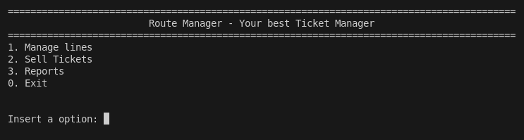

1. **Gerenciar Linhas**: Abre o menu de gerenciamento de linhas (criação, edição, remoção e listagem).
2. **Venda de bilhetes**: Abre o menu de venda de passagens e consulta de disponibilidade.
3. **Relatórios**: Abre o menu de relatórios gerenciais do sistema.
4. **Sair**: Encerra a execução do programa.

## 1.4 Gerenciamento de linhas

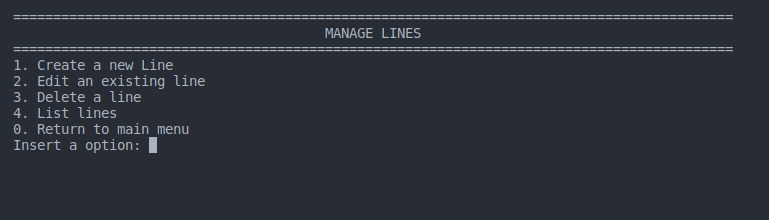

### 1.4.1 Cadastrar uma nova linha
A primeira ação recomendada é cadastrar uma nova linha; caso contrário, as outras opções ficarão indisponíveis ou não retornarão dados.
Será solicitado:
- Um ID único para a linha.
- Cidade de origem.
- Cidade de destino.
- Horário de partida (formato HH:MM).
- Preço da passagem.

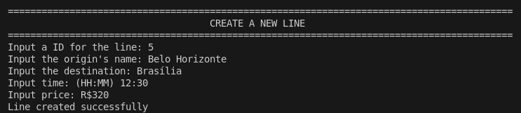

### 1.4.2 Editar uma linha existente
Se uma informação foi digitada incorretamente ou precisa ser atualizada, esta opção permite editar os dados.
Serão solicitados novamente todos os campos do item anterior; para manter o valor atual inalterado, basta pressionar **ENTER** sem digitar nada.

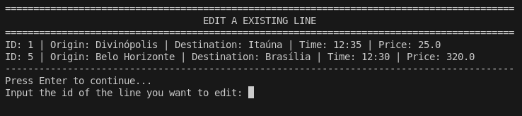
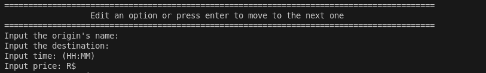

### 1.4.3 Remover uma linha existente
Caso seja necessário excluir uma linha, o sistema listará todas as rotas ativas e o usuário deverá digitar o ID correspondente para removê-la permanentemente.

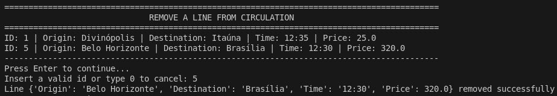

### 1.4.4 Listar todas as linhas cadastradas
Exibe na tela todas as linhas cadastradas no sistema, com seus respectivos detalhes (ID, Origem, Destino, Horário e Preço).

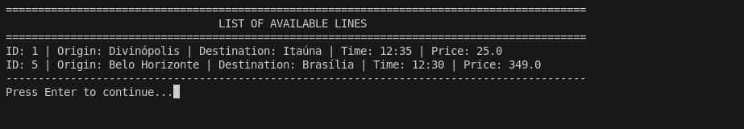

**0. Voltar ao menu principal**: Retorna ao menu principal para escolher outra opção ou encerrar o programa.

## 1.5 Sistema de vendas de passagens

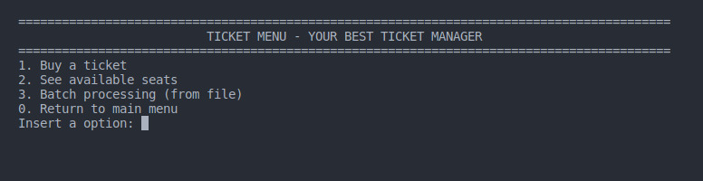

### 1.5.1 Vender passagens (uma por vez)
O sistema exibirá todas as linhas cadastradas. O usuário seleciona o ID da linha desejada, informa a data e confirma o horário. Em seguida, será mostrado um mapa visual dos assentos do ônibus (Janela e Corredor).
> Os assentos marcados com "X" indicam que já foram comprados/ocupados.


### 1.5.2 Exibir passagens disponíveis
Esta opção permite consultar disponibilidade por destino. O usuário informa a cidade de destino, a data e o horário desejado. O sistema exibirá os assentos disponíveis para essa configuração (se existirem ônibus para o trecho).
Após listar os assentos, o sistema perguntará se o usuário deseja realizar uma reserva imediata. Se "Sim", o processo de venda é iniciado; caso contrário, retorna ao menu.

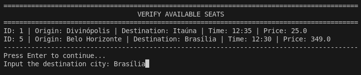

### 1.5.3 Carregar dados em lote (arquivo)
Esta função permite carregar múltiplas reservas a partir de um arquivo de texto. Cada linha do arquivo representa uma solicitação de reserva.

**Estratégia de Importação:** Como o arquivo de entrada contém apenas uma cidade, o sistema verifica se essa cidade corresponde à **Origem** OU ao **Destino** de alguma linha cadastrada. Se houver correspondência de local e horário, a passagem é validada e adicionada.

**Exemplo de estrutura de dados:**

Arquivo `data/reserves.txt` (Armazenamento interno):
```text
1,12/12/2025,12:30,7,8,1,0,2
5,12/12/2025,12:30,7
```

Arquivo `data/batch_reserves.txt` (Entrada para processamento):
```text
Maceió, 12:30, 12/12/2025, 7
Itaúna, 12:30, 15/12/2025, 4
Divinópolis, 12:20, 27/12/2025, 6
Itaúna, 12:30, 12/12/2025, 4
```

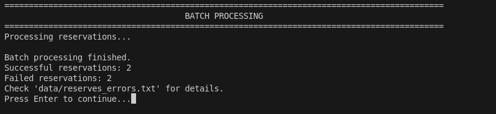

Arquivo de Log `data/reserves_errors.txt` (Registro de falhas):
```text
FAILED: Maceió, 12:30, 12/12/2025, 7 | REASON: No line found for Maceió at 12:30
FAILED: Divinópolis, 12:20, 27/12/2025, 6 | REASON: No line found for Divinópolis at 12:20
```

> [!WARNING]
> Consulte a seção [Avisos](#19-avisos) para detalhes críticos sobre o processamento em lote.

**0. Voltar ao menu principal**: Retorna ao menu principal.

## 1.6 Relatórios

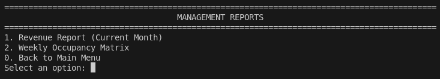

### 1.6.1 Receita mensal
Gera um relatório financeiro somando o valor de todas as passagens vendidas no mês e ano correntes, agrupado por linha.


### 1.6.2 Matriz de ocupação semanal
Calcula e exibe a porcentagem média de ocupação de cada linha para cada dia da semana (Segunda a Domingo). O cálculo considera o número de assentos vendidos dividido pela capacidade total (número de viagens realizadas * 20 assentos).

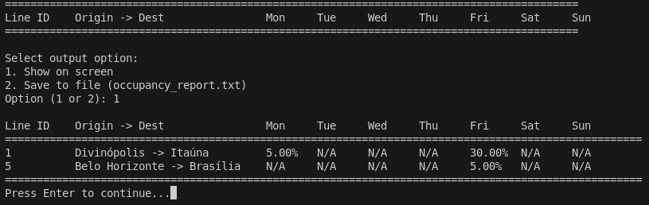

## 1.7 Conclusão

O programa **RouteManager** cumpre o objetivo de gerenciamento de linhas e passagens de ônibus de forma modular e eficiente. Através de uma interface de linha de comando, oferece um fluxo completo desde o cadastro administrativo (CRUD de linhas) até a operação comercial (venda e validação de assentos), incluindo funcionalidades avançadas como o processamento em lote e relatórios analíticos.

## 1.8 Limitações e Melhorias futuras

### Limitações
- **Interface:** O programa funciona apenas por linha de comando (CLI), sem interface gráfica (GUI).
- **Capacidade Fixa:** O sistema considera que todos os ônibus possuem capacidade fixa de 20 assentos.
- **Ambiguidade no Lote:** Importações em lote podem falhar se houver múltiplas linhas com a mesma cidade/horário, pois o sistema depende da correspondência única.

### Melhorias futuras
- Adicionar uma Interface Gráfica (GUI) para facilitar a navegação.
- Melhorar a inteligência da importação em lote para lidar com conflitos de rotas.
- Adicionar suporte para ônibus com diferentes capacidades e layouts.
- Implementar persistência em banco de dados SQL em vez de arquivos de texto.

## 1.9 Avisos

> [!WARNING]  
> **Processamento em Lote:** Devido ao formato simplificado do arquivo de entrada (`Cidade, Horário, Data, Assento`), podem ocorrer erros de importação. O arquivo fornece apenas uma cidade, enquanto uma rota é definida por Origem e Destino.
>
> **Lógica de Resolução:** O programa verifica se a cidade fornecida corresponde a **alguma** origem ou destino cadastrado no sistema. Se encontrar uma linha que coincida também com o horário fornecido, tenta realizar a reserva.

> [!CAUTION]  
> **Integridade dos Dados:** Se qualquer variável (Cidade, Data, Horário ou Assento) for inválida ou inconsistente (ex: assento ocupado, data passada, ônibus cheio), a reserva **não** será efetuada. Um registro do erro será gravado automaticamente no arquivo `data/reserves_errors.txt` para auditoria.

---

# 2. ENGLISH VERSION

## 2.1 How to start / exit the system

To start the system, open a terminal in the project root folder and run:

```bash
python3 main.py
```

After launching, the user will be directed to the **main screen**, where they can choose options by typing the corresponding number.

The system can be closed at any time by selecting:

    0 - Exit

All screens work the same way: the user must select a number and then press **ENTER**.

## 2.2 System options

The system is divided into three main modules: **Management** (Route administration), **Sales** (Commercial operation), and **Reports** (Data analysis). The details for each menu are described below.

## 2.3 Main Menu


1. **Manage Lines**: Opens the line management menu (create, edit, remove, list).
2. **Ticket Sales**: Opens the ticket sales and availability menu.
3. **Reports**: Opens the system reports menu.
4. **Exit**: Closes the system.

## 2.4 Line Management


### 2.4.1 Register a new line
The first action is to register a new line; otherwise, other options will be unavailable or return no data.
The user must provide:
- A unique ID for the line.
- Origin city.
- Destination city.
- Departure schedule (HH:MM format).
- Ticket price.


### 2.4.2 Edit an existing line
If a field was entered incorrectly or needs updating, this option allows editing the information.
All prompts from the previous item will be asked again; press **ENTER** without typing to keep the current value.


### 2.4.3 Remove an existing line
If you need to delete a line, the system will list all active lines, and you must enter the corresponding ID to remove it permanently.


### 2.4.4 List all registered lines
Displays all lines registered in the system with their details (ID, Origin, Destination, Time, and Price).


**0. Return to main menu**: Returns to the main menu.

## 2.5 Ticket Sales System


### 2.5.1 Sell tickets (one at a time)
The system will show all registered lines. The user selects the desired line ID, confirms the date and time, and then a visual seat map is shown.
> Seats marked with "X" are already sold/occupied.


### 2.5.2 Show available tickets
This option allows checking availability by destination. The user provides the destination city, date, and desired time. The system shows available seats for that configuration (if any).
After listing seats, the system asks if the user wants to make an immediate reservation. If "Yes," the purchase process begins; otherwise, it returns to the menu.


### 2.5.3 Batch import (from file)
This function loads multiple tickets from a text file. Each line in the file represents a reservation request.

**Import Strategy:** Since the input file contains only one city, the system checks if that city matches the **Origin** OR **Destination** of any registered line. If the location and time match, the ticket is validated and added.

**Example Data Structure:**

`data/reserves.txt` (Internal storage):
```text
1,12/12/2025,12:30,7,8,1,0,2
5,12/12/2025,12:30,7
```

`data/batch_reserves.txt` (Input for processing):
```text
Maceió, 12:30, 12/12/2025, 7
Itaúna, 12:30, 15/12/2025, 4
Divinópolis, 12:20, 27/12/2025, 6
Itaúna, 12:30, 12/12/2025, 4
```


`data/reserves_errors.txt` (Error Log):
```text
FAILED: Maceió, 12:30, 12/12/2025, 7 | REASON: No line found for Maceió at 12:30
FAILED: Divinópolis, 12:20, 27/12/2025, 6 | REASON: No line found for Divinópolis at 12:20
```

> [!WARNING]
> See the [Warnings](#29-warnings-and-cautions) section for critical details on batch processing.

**0. Return to main menu**: Returns to the main menu.

## 2.6 Reports


### 2.6.1 Monthly Revenue
Generates a financial report summing the value of all tickets sold in the current month and year, grouped by line.


### 2.6.2 Weekly Occupancy Matrix
Calculates and displays the average occupancy percentage for each line on each weekday (Monday to Sunday). The calculation considers the number of seats sold divided by the total capacity (number of trips made * 20 seats).


## 2.7 Conclusion

The **RouteManager** program successfully fulfills the goal of creating and managing bus routes and tickets. It offers a complete flow from administrative registration (CRUD) to commercial operations (sales and validation), including advanced features like batch processing and analytical reports, all within a command-line interface.

## 2.8 Limitations and Future Improvements

### Limitations
- **Interface:** The program works only through the command line (CLI), with no graphical user interface (GUI).
- **Fixed Capacity:** The system assumes all buses have a fixed capacity of 20 seats.
- **Batch Ambiguity:** Batch imports may fail if there are multiple lines matching the same city/time, as the system relies on unique matching.

### Future Improvements
- Add a Graphical User Interface (GUI) to improve navigation.
- Improve batch import logic to handle route conflicts better.
- Add support for buses with different capacities and layouts.
- Implement SQL database persistence instead of text files.

## 2.9 Warnings and cautions

> [!WARNING]  
> **Batch Processing:** Due to the simplified input format (`City, Time, Date, Seat`), import errors may occur. The file provides only one city, while a route is defined by Origin and Destination.
>
> **Resolution Logic:** The program checks if the provided city matches **any** origin or destination registered in the system. If a line matching the time is found, it attempts to make the reservation.

> [!CAUTION]  
> **Data Integrity:** If any variable (City, Date, Time, or Seat) is invalid or inconsistent (e.g., seat occupied, past date, bus full), the reservation will **not** be made. An error record will be automatically written to the `data/reserves_errors.txt` file for auditing.
